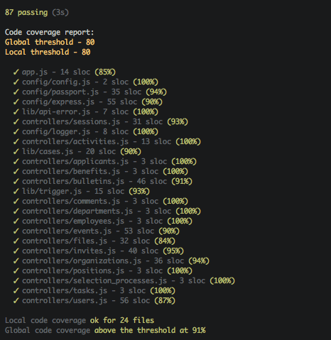

mocha-spec-cov-alt
==================
[](https://gitter.im/yamadapc/mocha-spec-cov-alt)
[](https://github.com/igrigorik/ga-beacon)
- - -

A Mocha reporter, which extends the `spec` runner to display and (optionally)
enforce blanket Code Coverage metrics. Applying it to other runners, should
be as simple as replacing the `.super_` `SpecCov` property.

I wrote a [blog post about it](http://blog.yamadapc.com.br/code-coverage-enforcement-for-nodejs)
a while back.



This was heavily inspired by Alex Seville's work on the
[`travis-cov`](https://github.com/alex-seville/travis-cov).

Install it with:
```
npm install mocha-spec-cov-alt
```

To use it, add the key `"spec-cov"` to the `"config": { "blanket": {} }` node
in your `package.json` file. Currently supported options are:

- `threshold` - A global threshold to enforce. (defaults to 80)
- `localThreshold` - A local threshold to enforce.
- `lcovOutput` - A path to a file to output `lcov` data to, for use with
  CodeClimate or CoverAlls. (by default, the file won't be generated)

You should then run mocha with:
```
mocha --require blanket -R mocha-spec-cov-alt
```

For more info on setting-up blanket, see: https://github.com/alex-seville/blanket

The annotated source is avaible at https://yamadapc.github.io/mocha-spec-cov-alt
and was generated with docco.

## License
Copyright (c) 2014 Pedro Tacla Yamada. Licensed under the MIT license.
Please refer to the [LICENSE](LICENSE) file for more info.
